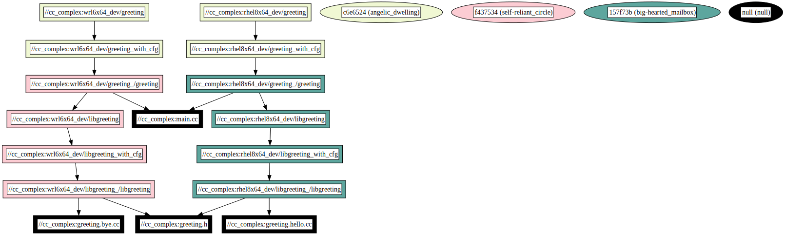

# cc_complex Example

This example demonstrates building a C++ project with variant rules, showcasing conditional source inclusion and dependency management based on build configurations.

## Overview

The `BUILD.bazel` file defines a `cc_library` target named `libgreeting` and a `cc_binary` target named `greeting`. The `libgreeting` target compiles a C++ library from source files conditionally included based on the build configuration. The `greeting` binary then depends on this library, illustrating how to manage dependencies with explicit configuration transitions.

### Dependency graph


## Usage

To build and run the examples, use the following commands:

### Building All Targets

To build all targets without specifying variants (this will skip all targets as no variants are specified):

```bash
bazel build :all
```

### Building with Specific Variants

- **For the `wrl6x64_dev` Variant:**

  ```bash
  bazel build :all --variants=wrl6x64_dev
  ```

  This command builds all `wrl6x64_dev` specific variants.

- **For All Supported Variants:**

  ```bash
  bazel build :all --variants=wrl6x64_dev --variants=rhel8x64_dev
  ```

  This builds all supported variants, demonstrating multi-variant builds.

### Building Specific Targets

- **Building `rhel8x64_dev/greeting`:**

  Without specifying variants, the build will fail due to incompatibility:

  ```bash
  bazel build :rhel8x64_dev/greeting
  ```

  To successfully build, specify the correct variant:

  ```bash
  bazel build :rhel8x64_dev/greeting --variants=rhel8x64_dev
  ```

- **Building Both `rhel8x64_dev/greeting` and `wrl6x64_dev/greeting`:**

  To build both targets with their respective variants:

  ```bash
  bazel build :rhel8x64_dev/greeting :wrl6x64_dev/greeting --variants=rhel8x64_dev --variants=wrl6x64_dev
  ```
