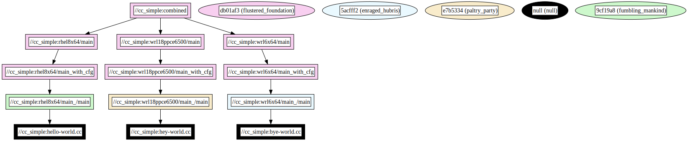

# cc_simple Example

This example showcases how to use variant rules to build C++ binaries with conditional source inclusion based on the build configuration.

## Overview

The `BUILD.bazel` file in this directory defines a `cc_binary` target named `main`. This target compiles a C++ binary from source files that are conditionally included based on the specified build configuration. Additionally, a `filegroup` named `combined` is defined to group together the binaries built from the `main` target under different configurations.

### Dependency graph


## Usage

To build and run the examples, use the following commands:

### Building and Running for Specific Platforms

- **RHEL 8 x86_64 Platform:**

  ```bash
  bazel run :rhel8x64/main --variants=rhel8x64
  ```

  **Expected Output:**

  ```
  Hello world
  ```

- **WRL 6 x86_64 Platform:**

  ```bash
  bazel run :wrl6x64/main --variants=wrl6x64
  ```

  **Expected Output:**

  ```
  Bye world
  ```

- **WRL 18 PPC e6500 Platform:**

  ```bash
  bazel run :wrl18ppce6500/main --variants=wrl18ppce6500
  ```

  **Expected Output:**

  ```
  Hey world
  ```

### Building the Combined Target

To build the `combined` target with all variants specified:

```bash
bazel build :combined --variants=rhel8x64 --variants=wrl6x64 --variants=wrl18ppce6500
```

This builds the `combined` target, grouping binaries for different platforms.

### Handling Incompatible Variants

Attempting to build the `combined` target with a subset of variants or a single variant results in an incompatibility error. For example:

```bash
bazel build :combined --variants=rhel8x64 --variants=wrl6x64
```

Bazel reports that the target is incompatible and cannot be built due to missing or incompatible variants.

### Building Specific Targets with Multiple Variants

It's possible to build specific targets while specifying multiple variants:

- **Building `rhel8x64/main` with Multiple Variants:**

  ```bash
  bazel build rhel8x64/main --variants=rhel8x64 --variants=wrl6x64 --variants=wrl18ppce6500
  ```

- **Building `wrl6x64/main` with Multiple Variants:**

  ```bash
  bazel build wrl6x64/main --variants=rhel8x64 --variants=wrl6x64 --variants=wrl18ppce6500
  ```

- **Building `wrl18ppce6500/main` with Multiple Variants:**

  ```bash
  bazel build wrl18ppce6500/main --variants=rhel8x64 --variants=wrl6x64 --variants=wrl18ppce6500
  ```
