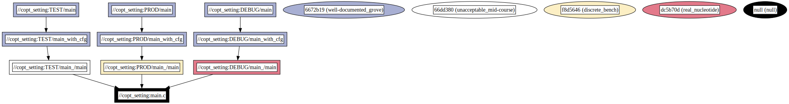

# copt_setting Example

This example demonstrates how to instruct Bazel to build C binaries with different configurations by specifying compile-time options in the `variant.spec.json` file.

## Overview

The `BUILD.bazel` file in this directory defines a `cc_binary` target named `main`. This target compiles a C binary from a source file, where compile-time options (`copt`) are used to define different build configurations such as `DEBUG`, `TEST`, and `PROD`. These configurations adjust the behavior of the compiler through flags, influencing debugging capabilities and optimization levels.

### Dependency graph


## Usage

To build and run the binary for different configurations, use the following commands:

### Building and Running for Specific Configurations

- **DEBUG Configuration:**

  ```bash
  bazel run :DEBUG/main --variants=DEBUG
  ```

  **Expected Output:**

  ```
  --------------
  Version:     LATEST
  Environment: DEBUG
  --------------
  ```

  In the `DEBUG` configuration, flags such as `-v` (verbose output) can help with understanding the behavior of the compiler, and `-g` instructs the compiler to produce outputs with debug symbols.

- **TEST Configuration:**

  ```bash
  bazel run :TEST/main --variants=TEST
  ```

  **Expected Output:**

  ```
  --------------
  Version:     BETA
  Environment: TEST
  --------------
  ```

- **PROD Configuration:**

  ```bash
  bazel run :PROD/main --variants=PROD
  ```

  **Expected Output:**

  ```
  --------------
  Version:     1.0FINAL2
  Environment: PROD
  --------------
  ```

  It is also possible to steer optimization levels with flags like `-O0` (no optimization) in the `TEST` configuration.

### Building All Variants at Once

To build all variants at once, you can use the `:all` target with all variants specified:

```bash
bazel build :all --variants=DEBUG --variants=TEST --variants=PROD
```
