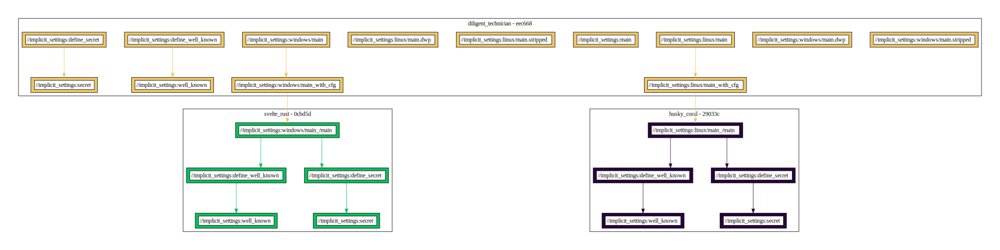

# implicit_settings example

This example demonstrates how to augument variation specification with extra options.

## Overview

The `BUILD.bazel` file in this directory defines a `cc_binary` target named `main`. This target compiles a C binary from a source file and depends on two targets that provide preprocessor define flags. The values of these targets are then used as part of the message printed by the compiled binary. `cc_define` targets are configurable due to `string_flag` targets. This package defines two targets of this kind. One represents a public, well-known value, which is defined explicitly per variant using the `variant.spec.json` file, while the other corresponds to an implicit setting provided via `extra.variation.json`. Entries specified in the latter file are referred to as `variation points`. They do not correspond to a specific variation but rather define a setting that should be included by all variations.

### Dependency graph


## Usage

To build and run the binary for different configurations, use the following commands:

### Building and Running for Specific Configurations

- **windows Configuration:**

  ```bash
  bazel run :windows/main
  ```

  **Expected Output:**

  ```
  --------------
  well_known:     blue
      secret:     hot
  --------------
  ```

- **linux Configuration:**

  ```bash
  bazel run :linux/main
  ```

  **Expected Output:**

  ```
  --------------
  well_known:     red
      secret:     hot
  --------------
  ```
