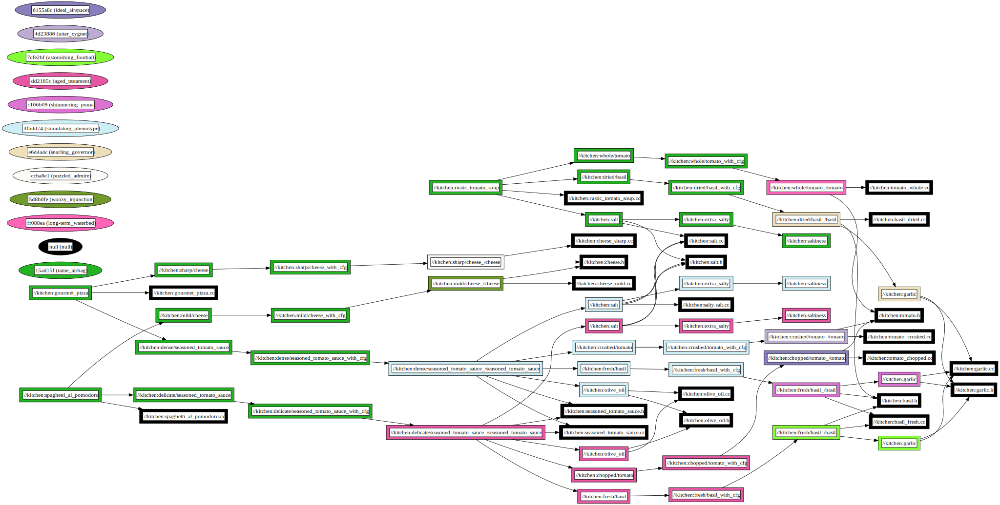

# Kitchen Variants with `rules_variant`

This example demonstrates the use of `rules_variant` in a C++ project, cleverly themed around a kitchen where binaries and libraries are akin to dishes and ingredients. It explores how different configurations of ingredients can significantly alter the outcome of the final dish, much like how build configurations can influence a software project.

## Overview

Our `BUILD.bazel` file is the recipe book for creating a variety of dishes such as `spaghetti_al_pomodoro`, `rustic_tomato_soup`, and `gourmet_pizza`, using ingredients that come in multiple variants. These variants, like `tomato`, `basil`, `cheese`, and `seasoned_tomato_sauce`, introduce variability not just in flavor but also in how they interact with other ingredients, affecting the overall composition and taste of the dishes.

### Dependency graph


## Flavorful Recipes and Their Variants

### Spaghetti al Pomodoro: A Balanced Ensemble

This dish marries `mild` cheese with `delicate` seasoned tomato sauce, `chopped` tomatoes, and `fresh` basil, aiming for a harmonious flavor profile.

**Build and Taste:**

```bash
bazel run :spaghetti_al_pomodoro --@@rules_kitchen//:variations=chopped --@@rules_kitchen//:variations=delicate --@@rules_kitchen//:variations=fresh --@@rules_kitchen//:variations=mild
```

**Output:**

```
Dish: Spaghetti al Pomodoro
Ingredient: Cheese - Mild
Ingredient: Delicate Seasoned Tomato Sauce
Ingredient: Tomato - Chopped
Ingredient: Basil - Fresh
Ingredient: Garlic - Noticable
Ingredient: Olive Oil
Ingredient: Salt
```

Dependency Tree:

```
spaghetti_al_pomodoro
├── delicate/seasoned_tomato_sauce
│   ├── chopped/tomato
│   ├── fresh/basil
│   │   └── garlic
│   ├── olive_oil
│   └── salt
└── mild/cheese
```

The choice of `fresh` basil not only adds a vibrant flavor but also subtly enhances the garlic's presence, making it more noticeable without overpowering the dish.

### Rustic Tomato Soup: A Hearty Experience

Opting for `whole` tomatoes and `dried` basil, this dish offers a robust flavor, with the `dried` basil introducing an earthy tone that complements the `whole` tomatoes.

**Build and Taste:**

```bash
bazel run :rustic_tomato_soup --@@rules_kitchen//:variations=whole --@@rules_kitchen//:variations=dried
```

**Output:**

```
Dish: Rustic Tomato Soup
Ingredient: Basil - Dried
Ingredient: Garlic - Distinct
Ingredient: Salt
Ingredient: Tomato - Whole
```

Dependency Tree:

```
rustic_tomato_soup
├── dried/basil
│   └── garlic
├── salt
└── whole/tomato
```

The `dried` basil not only changes the flavor profile but also alters how the garlic is perceived, making its taste more distinct compared to when `fresh` basil is used.

### Gourmet Pizza: An Intense Flavor Journey

This pizza features `sharp` cheese and a `dense` seasoned tomato sauce made from `crushed` tomatoes, topped with `fresh` basil, designed for those who favor bold flavors.

**Build and Taste:**

```bash
bazel run :gourmet_pizza --@@rules_kitchen//:variations=crushed --@@rules_kitchen//:variations=dense --@@rules_kitchen//:variations=sharp --@@rules_kitchen//:variations=fresh
```

**Output:**

```
Dish: Gourmet Pizza
Ingredient: Cheese - Sharp
Ingredient: Dense Seasoned Tomato Sauce
Ingredient: Tomato - Crushed
Ingredient: Basil - Fresh
Ingredient: Garlic - Noticable
Ingredient: Olive Oil
Ingredient: Salt
Ingredient: Salty Salt
```

Dependency Tree:

```
gourmet_pizza
├── dense/seasoned_tomato_sauce
│   ├── crushed/tomato
│   ├── fresh/basil
│   │   └── garlic
│   ├── olive_oil
│   └── salt
│       └── extra_salty
└── sharp/cheese
```

Selecting the `dense` seasoned tomato sauce not only intensifies the flavor but also increases the salt content, as indicated by the inclusion of "Salty Salt" in the output. This choice results in a richer and more complex flavor profile, where the `sharp` cheese and `crushed` tomatoes contribute to the dish's intensity.

## The Art of Ingredient Interaction

The `kitchen.spec.json` file outlines the available variants, allowing for a creative approach to combining flavors. This flexibility demonstrates how variant selections can dynamically alter not just individual components but also their interactions, affecting the overall character of the build. Through `bazel run` commands specifying desired variants, developers can easily experiment with these combinations, tailoring the "taste" of their applications to meet specific preferences or requirements.
