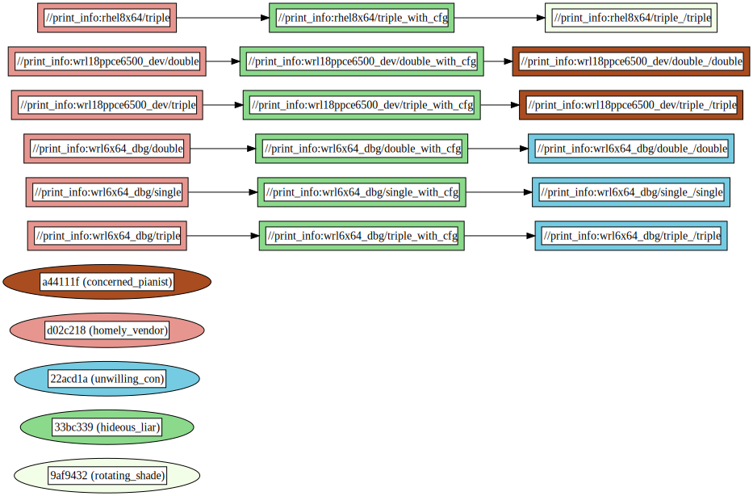

# Print Info Example

This example demonstrates the use of the `info` rule from the `rules_info` repository to print information about the currently used platform or target. It's particularly useful for debugging and verifying build configurations across different variants.

## Overview

The `BUILD.bazel` file defines three `info` targets (`triple`, `double`, and `single`) that are configured to print details for multiple configurations. This showcases the ability to handle and debug multiple platform configurations within a single target.

### Dependency graph


## Usage

To use this example, run the following commands in the `print_info` directory:

- To print information for all three configurations (`rhel8x64`, `wrl18ppce6500_dev`, and `wrl6x64_dbg`):

  ```
  bazel build :all --variants=rhel8x64 --variants=wrl18ppce6500_dev --variants=wrl6x64_dbg
  ```

- To print information for two configurations (`rhel8x64` and `wrl18ppce6500_dev`):

  ```
  bazel build :all --variants=rhel8x64 --variants=wrl18ppce6500_dev
  ```

- To print information for a single configuration (`rhel8x64`):

  ```
  bazel build :all --variants=rhel8x64
  ```
