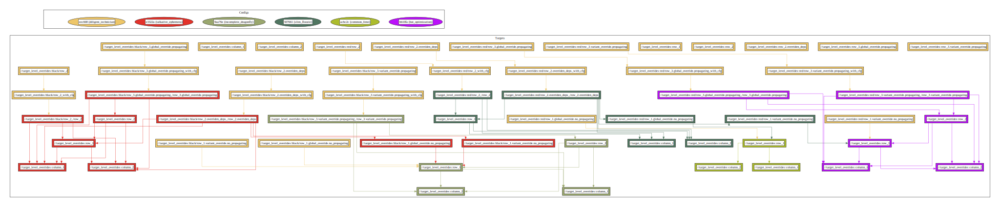

# target_level_overrides example

This example demonstrates how to override build settings defined in variant spec on a target level.

## Overview

The `BUILD.bazel` file in this directory defines two `column` targets of
`string_flag` type, each configurable to either `red` or `black` colour.
Secondly, the file defines targets of `row` type, responsible for printing
values of the columns and other rows they depend on. Effective output shows how
configuration of indvidual targets is affected depending on how build setting
overrides are applied. Additionally, `variant.spec.json` specifies two
variations, each of which sets both columns to the same color value -
representing default colouring subjected to change by target level overrides.

### Dependency graph

