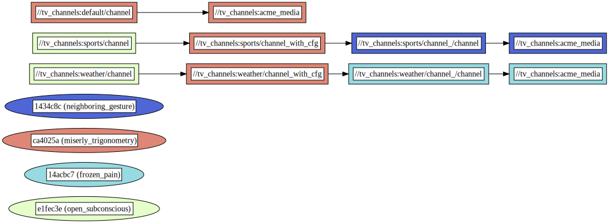

# TV and Radio Channels Example

This example demonstrates the use of `rules_variant` to configure and TV, radio channels with content that varies based on the build configuration. It utilizes custom rules, macros, and genrules to showcase dynamic configuration adjustments.

## Overview

The `BUILD.bazel` file defines a `content_provider` that selects content based on the active build configuration. A macro `vgenrule` is used to create a variant of the native `genrule` which is configured dynamically to handle TV channels. A standard `genrule` is used for the default radio channel.

### Dependency graph


## Usage

To build and run the TV and radio channels with different configurations, use the following commands:

### Building and Running TV Channel with Sports Configuration
```
bazel build :sports/channel
```

**Expected Output:**

```
INFO: Analyzed target //tv_channels:sports/channel (7 packages loaded, 19 targets configured).
INFO: From Executing genrule //tv_channels:sports/channel_/channel:

            Device: TV
           Channel: sports
             Plays: basketball on ice

INFO: Found 1 target...
Target //tv_channels:sports/channel_with_cfg up-to-date:
  .bld/out/k8-fastbuild-ST-1bb1579ba182/bin/tv_channels/sports/play
INFO: Elapsed time: 0.189s, Critical Path: 0.01s
INFO: 2 processes: 1 internal, 1 processwrapper-sandbox.
INFO: Build completed successfully, 2 total actions
```

### Building and Running TV Channel with Weather Configuration
```
bazel build :weather/channel
```

**Expected Output:**
```
INFO: Analyzed target //tv_channels:weather/channel (0 packages loaded, 11 targets configured).
INFO: From Executing genrule //tv_channels:weather/channel_/channel:

            Device: TV
           Channel: weather
             Plays: hot or not

INFO: Found 1 target...
Target //tv_channels:weather/channel_with_cfg up-to-date:
  .bld/out/k8-fastbuild-ST-152a3ef1fa72/bin/tv_channels/weather/play
INFO: Elapsed time: 0.084s, Critical Path: 0.01s
INFO: 2 processes: 1 internal, 1 processwrapper-sandbox.
INFO: Build completed successfully, 2 total actions
```

### Building and Running the Default Radio Channel
```
bazel build :default/channel
```

**Expected Output:**

```
INFO: Analyzed target //tv_channels:default/channel (0 packages loaded, 6 targets configured).
INFO: From Executing genrule //tv_channels:default/channel:

           Device: Radio
            Plays: commercials

INFO: Found 1 target...
Target //tv_channels:default/channel up-to-date:
  .bld/bin/tv_channels/play
INFO: Elapsed time: 0.078s, Critical Path: 0.01s
INFO: 2 processes: 1 internal, 1 processwrapper-sandbox.
INFO: Build completed successfully, 2 total actions
```
