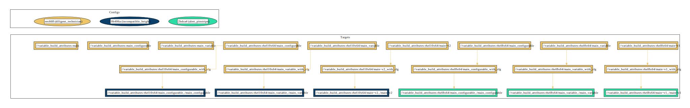

# variable_build_attributes example

This example demonstrates how to instantiate targets with variant-specific attributes.


## Overview

The `BUILD.bazel` file in this directory defines 3 scenarios of how variants of a `cc_binary` can be instantiated so that different attribute values are applied depending on the selected variant. Examples presented show how to use `variant_args` attribute to steer variant target instantiation. Finally the example showcases difference in how configuration is evaluated compared to semantically similar `select` statements.

### Dependency graph


## Usage

To build and run the binary for different configurations, use the following commands:

### Building and Running for Specific Configurations

- **select-based rhel8x64 variant:**

  ```bash
  bazel run :rhel8x64/main_configurable
  ```

  **Expected Output:**

  ```
  --------------
  It's an older code, sir, but it checks out.
  --------------
  ```

- **select-based rhel10x64 variant:**

  ```bash
  bazel run :rhel10x64/main_configurable
  ```

  **Expected Output:**

  ```
  --------------
  Nowadays, the society is governed by systemd modules.
  --------------
  ```

- **simple variant_args-based rhel8x64 variant:**

  ```bash
  bazel run :rhel8x64/main_variable
  ```

  **Expected Output:**

  ```
  --------------
  It's an older code, sir, but it checks out.
  --------------
  ```

- **simple variant_args-based rhel10x64 variant:**

  ```bash
  bazel run :rhel10x64/main_variable
  ```

  **Expected Output:**

  ```
  --------------
  Nowadays, the society is governed by systemd modules.
  --------------
  ```

- **complex variant_args-based rhel8x64 variant:**

  ```bash
  bazel run :rhel8x64/main~v1
  ```

  **Expected Output:**

  ```
  --------------
  It's an older code, sir, but it checks out.
  --------------
  ```

- **complex variant_args-based rhel10x64 variant:**

  ```bash
  bazel run :rhel10x64/main~v1
  ```

  **Expected Output:**

  ```
  --------------
  Nowadays, the society is governed by systemd modules.
  --------------
  ```

- **unprefixed instance of a variant using variant_args attribute:**

  ```bash
  bazel run :main
  ```

  **Expected Output:**

  ```
  BUILD.bazel:68:10: target '//variable_build_attributes:main' is deprecated:
  Values specified in the "variant_args" attribute:
  {
      "rhel8x64": {"name": "main~v1", "srcs": ["older.main.c"], "tags": ["no-regrets"]},
      "rhel10x64": {"name": "main~v2", "srcs": ["modern.main.c"], "tags": ["no-tears"]}
  }
  
  are not applicable to the non-variant target:
      "@//variable_build_attributes:main"
  
  Please refer to one of variant targets instead:
  [
      "@//variable_build_attributes:rhel8x64/main",
      "@//variable_build_attributes:rhel10x64/main"
  ]
  
  Target //variable_build_attributes:main failed to build
  Use --verbose_failures to see the command lines of failed build steps.
  ERROR: Analysis of target '//variable_build_attributes:main' failed; build aborted: Target //variable_build_attributes:main is incompatible and cannot be built
  ```
